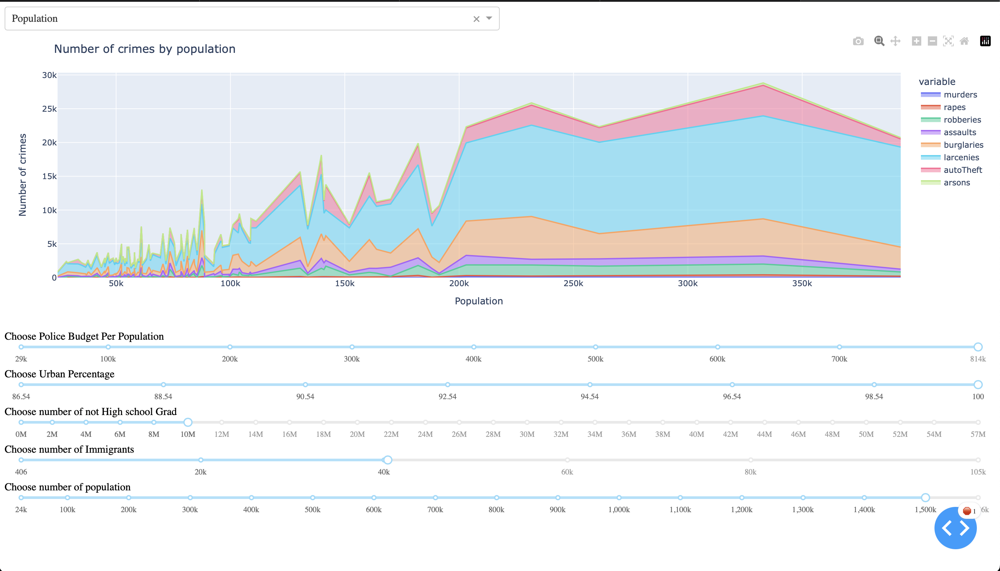

# Crimes_in_US_Communities_dash

Чтобы хороший дашборд, необходимо выбрать те значения, которые все-таки существуют в датасете. Например, я заинтересовался и заметил, что средний процент жителей городов == 99, а стандартное отклоение - единичка. Остюда мы понимаем две вещи:

1. В Америке городом считают все подряд
2. Чтобы получить норм график нужно выбрать процент близкий к ста.

